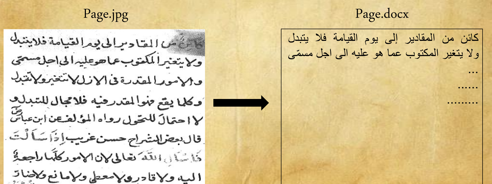
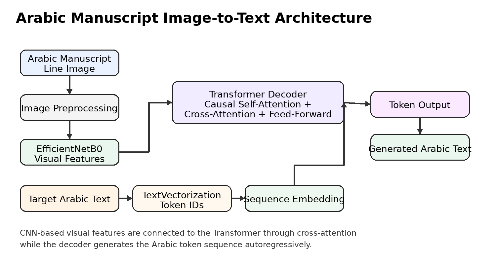
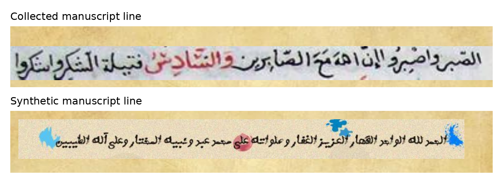
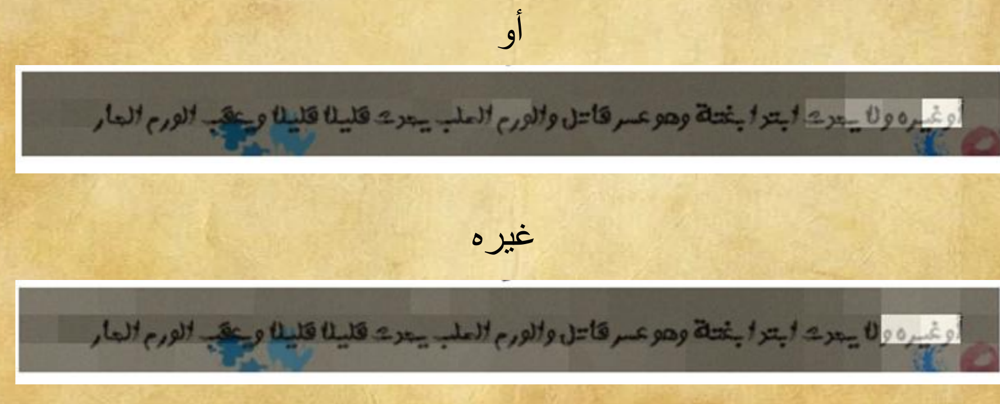

# Arabic Manuscript OCR

An academic deep-learning project for converting images of **Arabic handwritten manuscript lines** into digital Arabic text.

The project explores computer vision and deep learning techniques for helping digitize old and damaged Arabic manuscripts and making their content easier to search, edit, and preserve.

---

## 🎯 Project Goal

The project aimed to develop an intelligent system for processing and digitizing old Arabic manuscripts.

Historical manuscripts can contain challenging visual conditions such as:

- Degraded or damaged pages
- Uneven backgrounds
- Faded ink
- Noise and stains
- Different handwriting styles
- Closely spaced or overlapping words

Several image-processing approaches were investigated before moving toward a deep-learning image-to-text system.

### From Manuscript Image to Digital Text

<p align="center">
  
</p>

---

## 🔬 Development Approach

The project went through several stages during development.

### 1. Traditional Image Processing

Several classical image-processing techniques were investigated for improving manuscript images and extracting useful information:

- Static thresholding
- Dynamic thresholding
- Otsu binarization
- Canny edge detection
- Image filtering
- Hough transform
- Mexican Hat filtering
- SIFT feature detection
- FAST feature detection
- Document restoration experiments

These approaches were useful for experimentation, but old manuscript images introduced difficult backgrounds, stains, faded ink, and other variations that made reliable text extraction challenging.

### 2. Contour-Based Word Extraction

A contour-based approach was also investigated to extract individual words from manuscript images.

This approach was not reliable because:

- Words could be very close to each other
- Some words could overlap
- Different regions could touch each other
- Contours were not consistently suitable for separating manuscript words

Because of these limitations, the project moved toward a learned image-to-text approach.

### 3. Deep Learning Image-to-Text

The project then explored an image-to-text generation system capable of learning the relationship between manuscript images and their corresponding Arabic text.

The main architecture combines:

- A CNN-based visual feature extractor
- A Transformer-based decoder
- Self-attention
- Cross-attention between text generation and visual features

---

## 🏗️ Model Architecture

The developed system follows an image-to-text architecture.

<p align="center">
  
</p>

### Image Feature Extraction

CNN-based architectures were investigated for extracting visual features from manuscript images.

The project experimented with architectures including:

- MobileNet
- EfficientNet

Because the manuscript images used a custom input shape, the visual feature extractor was trained for the manuscript data rather than relying only on an unchanged off-the-shelf image model.

The manuscript images were processed as **line images** rather than complete manuscript pages. This helped reduce memory usage and computational requirements during training.

### Transformer Decoder

The text-generation component uses a Transformer decoder to generate Arabic text from the extracted visual features.

The decoder includes:

- Token embeddings
- Positional information
- Causal self-attention
- Cross-attention to image features
- Feed-forward layers
- Autoregressive text generation

The cross-attention mechanism allows the decoder to use visual information from the manuscript while generating the output sequence.

---

## 📊 Dataset Preparation

Because a suitable ready-to-use labeled dataset for this specific task was not available for the project, a dataset was prepared for training.

The project focused on **manuscript line images** rather than complete pages.

The dataset preparation included approximately:

- **20,000 manuscript line images**
- **20,000 additional synthetic manuscript line images**
- Image preprocessing
- Data augmentation

### Dataset Examples

<p align="center">
  
</p>

The resulting image representation used dimensions of approximately:

```text
70 × 800 × 3
```

Working with line images made it more practical to train the image-to-text model than using complete manuscript pages.

### Public Dataset

The manuscript dataset prepared for this project is publicly available on Kaggle under:

```text
mahmoudbannan/manuscripts
```

It can be downloaded programmatically using `kagglehub`:

```python
import kagglehub

path = kagglehub.dataset_download("mahmoudbannan/manuscripts")

print("Path to dataset files:", path)
```

The dataset contains the manuscript data prepared for the experiments described in this repository.

> The model's ability to generalize is still limited by the diversity of handwriting styles represented in the dataset.

---

## 🧪 Model Experiments

Different architectures and configurations were investigated throughout the project.

### MobileNet Experiment

A MobileNet-based approach was explored as a visual feature extractor.

The project presentation reported the following result for one of the later MobileNet-based experiments:

```text
Training Accuracy:   99.66%
Validation Accuracy: 79.40%
```

The difference between training and validation performance demonstrated the difficulty of generalizing from the available training data.

### EfficientNet Experiment

A later experiment investigated EfficientNet as the visual feature extractor.

The project presentation reported:

```text
Training Accuracy:   99.82%
Validation Accuracy: 96.23%
```

This experiment showed a substantial improvement in validation performance compared with the reported MobileNet experiment.

> These values are the reported results of the corresponding experiments. They should not be interpreted as universal OCR accuracy or as a standardized character-level OCR metric.

---

## 💾 Model Availability

The repository includes the trained **CNN-based visual feature extractor** used in the project.

The complete trained end-to-end image-to-text model — including the Transformer-based text-generation component — is unfortunately no longer available.

As a result:

- The trained CNN visual feature extractor is preserved.
- The source code for the complete image-to-text architecture is preserved.
- The training workflow is preserved.
- The dataset used for the project is publicly available.
- The final trained end-to-end model checkpoint is not available.

Reproducing the complete OCR model therefore requires retraining the Transformer/image-to-text pipeline using the provided source code and dataset.

---

## 🔎 Attention Visualization

The implementation includes attention visualization to inspect which regions of a manuscript image contribute to the generation of individual output tokens.

<p align="center">
  
</p>

Conceptually:

```text
Manuscript Image
       ↓
Visual Features
       ↓
Cross-Attention
       ↓
Generated Arabic Token
```

Attention visualization was used during the experiments to better understand the behavior of the image-to-text model and the relationship between image regions and generated text.

---

## ⚠️ Limitations

The model is **not intended to recognize every style of Arabic handwriting**.

Its performance depends strongly on the handwriting styles represented in the training data.

Because the available dataset was limited in both **size and diversity**, the model generalized better to handwriting styles similar to those represented during training.

As a result, performance can decrease significantly when the model encounters substantially different handwriting styles or manuscript sources.

This limitation is one of the main challenges identified during the project.

### Additional Limitations

- The dataset focused primarily on line-level images rather than complete manuscript pages.
- The diversity of historical handwriting styles was limited.
- The system is not a universal solution for all Arabic manuscripts.
- Traditional word-segmentation approaches were unreliable for some manuscript layouts.
- The project was not evaluated against a large standardized Arabic handwritten OCR benchmark.
- The reported experiment accuracy values are not equivalent to Character Error Rate (CER) or Word Error Rate (WER).
- The complete trained end-to-end image-to-text checkpoint is no longer available.

---

## 🚀 Future Improvements

Possible directions for improving the system include:

- Building a larger Arabic handwritten manuscript dataset
- Increasing the diversity of handwriting styles
- Adding more historical manuscript sources
- Improving generalization to unseen handwriting styles
- Developing more robust manuscript line and word segmentation
- Evaluating the system using OCR-specific metrics such as Character Error Rate (CER) and Word Error Rate (WER)
- Supporting page-level manuscript processing
- Exploring stronger vision-language architectures
- Expanding attention-based interpretability and analysis
- Retraining and preserving a complete end-to-end model checkpoint

---

## 🛠️ Technologies

- Python
- TensorFlow
- Keras
- OpenCV
- Convolutional Neural Networks
- Transformer
- Computer Vision
- Deep Learning
- Optical Character Recognition
- Arabic Handwriting Recognition
- KaggleHub

---

## 🚀 Getting Started

### Clone the Repository

```bash
git clone https://github.com/Mahmoudmnb/arabic-manuscript-ocr.git
cd arabic-manuscript-ocr
```

### Create a Virtual Environment

```bash
python -m venv .venv
```

Activate it on Linux/macOS:

```bash
source .venv/bin/activate
```

Or on Windows:

```bash
.venv\Scripts\activate
```

### Install Dependencies

```bash
pip install -r requirements.txt
```

### Download the Dataset

The dataset can be downloaded using KaggleHub:

```python
import kagglehub

path = kagglehub.dataset_download("mahmoudbannan/manuscripts")

print("Dataset path:", path)
```

If `kagglehub` is not already installed:

```bash
pip install kagglehub
```

Update the dataset paths used by the experiment scripts or notebooks to point to the downloaded dataset location before running the training workflow.

### Environment Notes

The deep-learning experiments were originally developed using **Google Colab and Google Drive**.

Some dataset paths and model-artifact paths are therefore environment-specific and may need to be adapted before running the training or inference workflow locally.

The complete trained end-to-end model is not included, so full inference requires retraining the image-to-text model.

---

## 📂 Repository Structure

The repository is organized to separate the final deep-learning experiments from the earlier traditional image-processing research.

```text
arabic-manuscript-ocr/
│
├── docs/
│   └── images/
│       ├── 01-input-to-text.png
│       ├── 02-dataset-examples.png
│       ├── 03-model-architecture.png
│       └── 04-attention-visualization.png
│
├── experiments/
│   │
│   ├── deep_learning/
│   │   ├── AAHR.ipynb
│   │   ├── image_captioning_EffNet.ipynb
│   │   └── image_to_text_transformer_training.py
│   │
│   └── traditional_image_processing/
│       ├── filter_comparison_experiment.py
│       ├── hanning_blur_experiment.py
│       ├── hough_line_detection_experiment.py
│       ├── mexican_hat_filter_experiment.py
│       ├── sift_feature_detection_experiment.py
│       ├── static_threshold_resize_experiment.py
│       └── thresholding_histogram_experiment.py
│
├── images/
│
├── src/
│   └── models/
│       └── ...
│
├── .gitignore
├── LICENSE
├── README.md
├── REFACTOR_NOTES.md
└── requirements.txt
```

### `experiments/deep_learning/`

Contains the main image-to-text experiments, including CNN-based visual feature extraction, Transformer decoding, training, inference, and attention visualization.

### `experiments/traditional_image_processing/`

Contains the earlier experimental approaches explored during the research process, including thresholding, filtering, Hough transforms, SIFT, and related manuscript-processing techniques.

These experiments are intentionally preserved because they document the development path that eventually led to the deep-learning approach.

### `src/models/`

Contains the trained CNN-based visual feature extractor preserved from the original project.

The complete trained image-to-text model checkpoint is no longer available. The repository retains the implementation required to reconstruct and retrain the complete architecture.

### `docs/images/`

Contains the images used to document the project and its results in this README.

---

## 🎓 Academic Context

**Project:** Arabic Manuscript Restoration and Digitization Using Deep Learning  
**Institution:** University of Aleppo  
**Faculty:** Faculty of Informatics Engineering  
**Department:** Artificial Intelligence

The project was developed as an academic exploration of computer vision and deep-learning techniques for the restoration, recognition, and digitization of Arabic manuscripts.

---

## 📌 Project Status

**Academic / Experimental Project**

This repository preserves the implementation, experiments, dataset references, trained CNN visual feature extractor, and research workflow developed during the project.

It should be considered a **research and learning project rather than a production-ready OCR system**.

The system performs best on handwriting styles similar to those represented in its training data and should not be interpreted as a universal Arabic handwriting-recognition solution.

The manuscript dataset used by the project is publicly available on Kaggle as:

```text
mahmoudbannan/manuscripts
```

The repository also preserves the trained CNN visual feature extractor. However, the final trained end-to-end image-to-text model checkpoint is no longer available, so reproducing the complete model requires retraining the Transformer-based recognition pipeline.

---

## 📄 License

This project is distributed under the terms described in the [`LICENSE`](LICENSE) file.

---

## 👨‍💻 Author

**Mahmoud Bannan**

Flutter Developer & Audio AI Engineer

[Portfolio](https://mahmoudbannan.com)